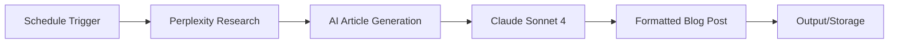

# AI Blog Journalist


Automated blog content creation workflow that uses Perplexity AI for research and Claude Sonnet 4 for professional article generation. Runs on schedule to produce publication-ready blog posts.

## Overview

This n8n workflow automates the entire blog content creation process. It uses Perplexity's Sonar Pro model to research the latest trends and news, then generates high-quality, professional blog articles using Anthropic's Claude Sonnet 4 with proper structure, examples, and actionable takeaways.

### Workflow Diagram



## Key Features

- **Automated Research** - Perplexity Sonar Pro scans the latest week's content
- **Professional Writing** - Claude Sonnet 4 generates polished, publication-ready articles
- **Structured Output** - Consistent format with title, introduction, main sections, and conclusion
- **Targeted Content** - Focus on specific industries (e.g., vacation rental, AI trends)
- **Clean Formatting** - No SEO spam or keyword stuffing, just quality content
- **Scheduled Execution** - Runs automatically on interval (configurable)
- **800-1200 Words** - Professional article length for blog publication

## Quick Start

### Prerequisites

- n8n instance (version 1.0 or higher)
- Perplexity API account with Sonar Pro access
- Anthropic API account (Claude Sonnet 4 access)

### Installation

1. Download the workflow:
   ```bash
   wget https://raw.githubusercontent.com/jeremylongshore/ai-blog-journalist-n8n/main/workflow.json
   ```

2. Import into n8n:
   - Navigate to **Workflows** → **Import from File**
   - Select `workflow.json`
   - Click **Import**

3. Configure credentials:
   - **Perplexity API**: Add your API key
   - **Anthropic API**: Add your Claude API key

4. Customize the research prompt for your industry

5. Set schedule interval (default: every minute for testing)

6. Activate the workflow

## Configuration

### Research Prompt Customization

Edit the Perplexity node to target your industry:

```javascript
"Research the latest AI news that would be interesting to blog about.
Select and return only new, interesting updates in the [YOUR INDUSTRY]
for a blog aimed at a non-technical audience."
```

Replace `[YOUR INDUSTRY]` with:
- vacation rental industry
- SaaS technology
- e-commerce trends
- marketing automation
- etc.

### Writing Style Configuration

The Claude Sonnet 4 system prompt enforces:

**Content Structure**:
1. Compelling title
2. Engaging introduction (2-3 paragraphs)
3. 3-4 main sections with ## headings
4. Practical examples or case studies
5. Strong conclusion with actionable takeaways

**Writing Style**:
- Professional yet conversational tone
- Direct, actionable language
- Focus on value for the reader
- 800-1200 words total
- Concrete examples and data

**What to Avoid**:
- SEO keyword stuffing
- Meta descriptions or tags
- Marketing fluff or promotional language
- Technical jargon without explanation

### Schedule Configuration

Default trigger: Every minute (for testing)

For production, change to:
- Daily: `0 0 * * *` (midnight)
- Weekly: `0 0 * * 1` (Monday midnight)
- Custom interval via Schedule Trigger node

## Usage

### Article Output

The workflow generates blog posts with this structure:

```markdown
# [Article Title]

[Engaging 2-3 paragraph introduction]

## [Main Section 1]
[Content with examples]

## [Main Section 2]
[Content with case studies]

## [Main Section 3]
[Content with data/examples]

## Conclusion
[Actionable takeaways and summary]
```

### Customizing Output Destination

Current setup outputs to workflow execution data. To save articles:

1. **Add Google Docs node** - Save to Google Drive
2. **Add Notion node** - Save to Notion database
3. **Add Airtable node** - Store in CRM/content calendar
4. **Add Email node** - Send to editorial team

## Documentation

- [Setup Guide](docs/setup-guide.md) - Detailed installation instructions
- [Contributing](CONTRIBUTING.md) - How to contribute improvements
- [Project Website](https://jeremylongshore.github.io/ai-blog-journalist-n8n/)

## Troubleshooting

**Perplexity API errors**:
- Verify API key is valid
- Check account has Sonar Pro access
- Verify recency setting is supported

**Claude API errors**:
- Verify Anthropic API key is valid
- Check Claude Sonnet 4 model access
- Review API credit balance

**Article quality issues**:
- Refine research prompt to be more specific
- Adjust system prompt for desired style
- Add example articles to prompt for reference

**Schedule not triggering**:
- Verify workflow is activated
- Check schedule trigger configuration
- Review n8n execution logs

## Example Research Topics

- Latest AI developments in your industry
- Emerging technology trends
- Case studies and success stories
- How-to guides and tutorials
- Industry news and analysis

## API Costs

Approximate costs per article:
- **Perplexity Sonar Pro**: ~$0.01-0.05 per research query
- **Claude Sonnet 4**: ~$0.10-0.30 per article (800-1200 words)
- **Total**: ~$0.15-0.35 per article

## Contributing

Contributions welcome! See [CONTRIBUTING.md](CONTRIBUTING.md) for guidelines.

## License

MIT License - see [LICENSE](LICENSE) file for details.

## Acknowledgments

- Built with [n8n](https://n8n.io)
- Powered by [Perplexity AI](https://perplexity.ai) and [Anthropic Claude](https://anthropic.com)
- Optimized for quality content creation

---

**Need help?** Open an issue or check the [documentation site](https://jeremylongshore.github.io/ai-blog-journalist-n8n/).
